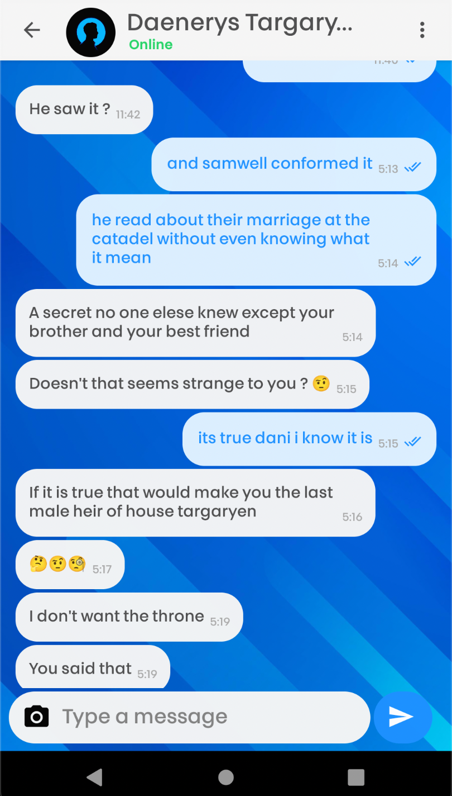
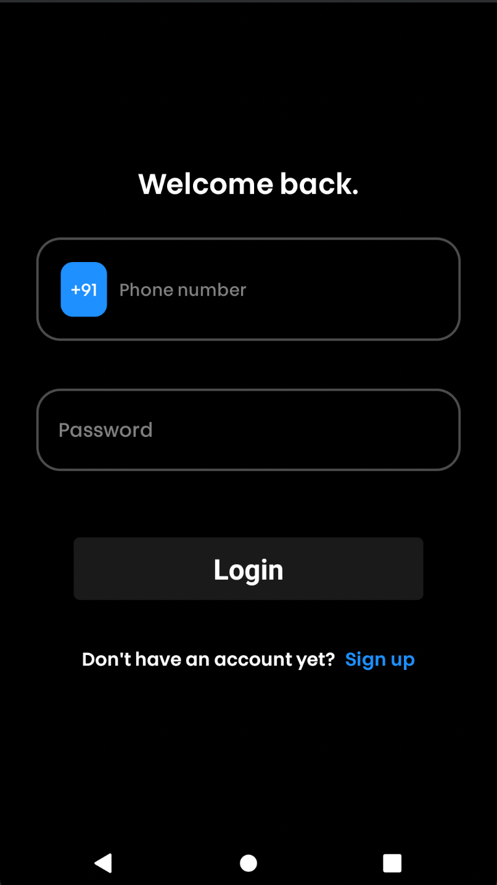
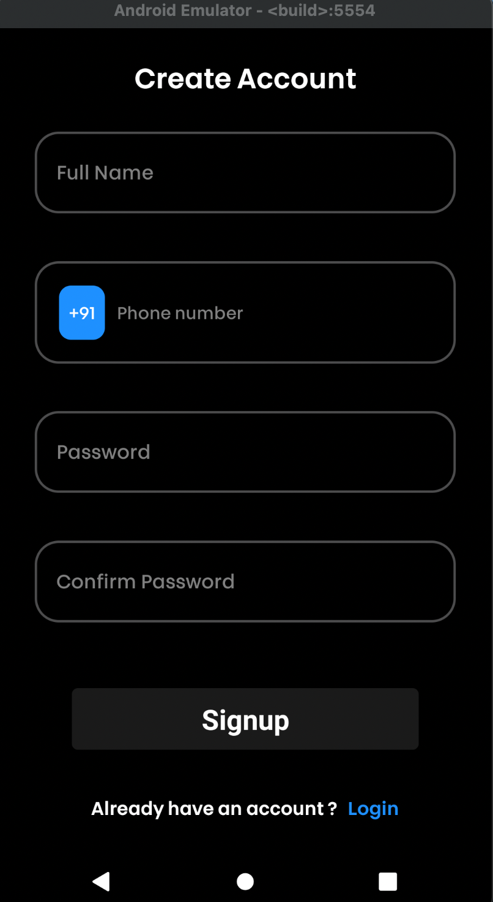
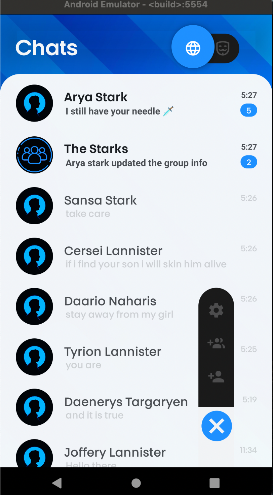
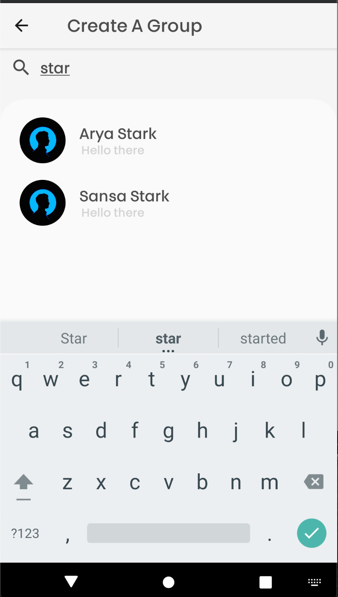
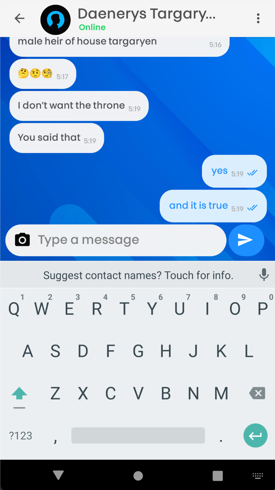
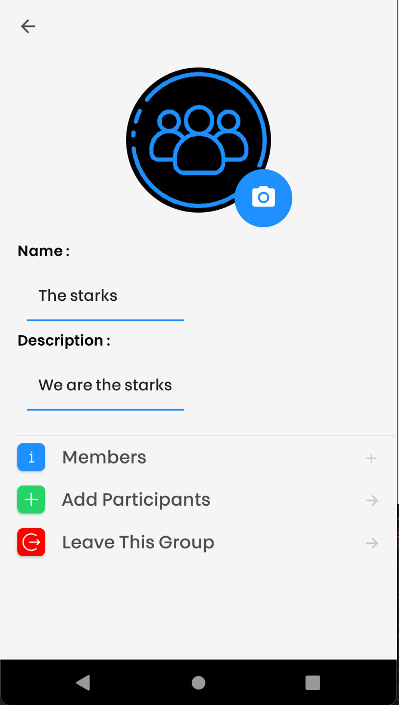
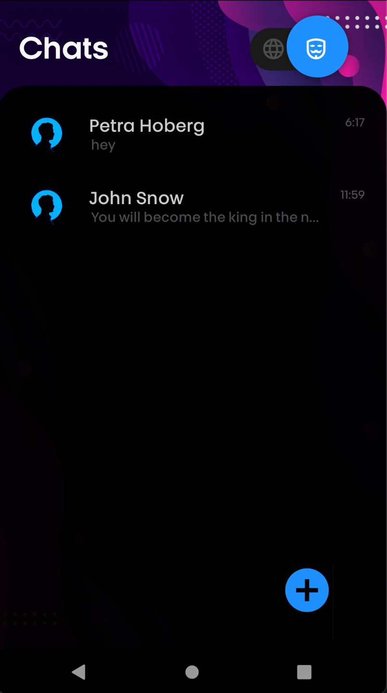
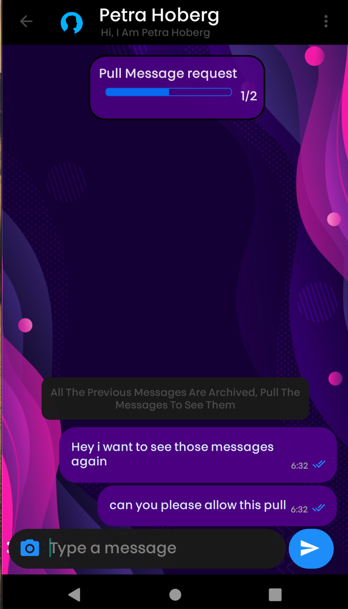
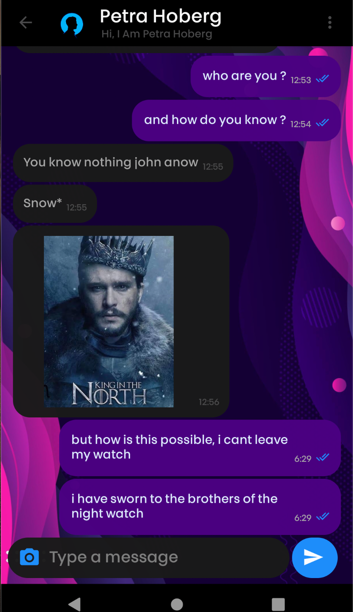

<!-- PROJECT LOGO -->
<br />
<p align="center">
  <a href="https://github.com/yashaggarwal85d/securechat">
    
  </a>
  <h3 align="center">🔒Secure🔑Chat</h3>
<br/>
  <p align="center">
    Secure chat is a cross platform end to end encrypted instant messaging service with different modes of security and visibility.
    A blockchain based secure backend for decentralisation of the platform and storing sensitive information, another server for centeralized management of the application.
    Users can send one-to-one and group messages, which can include emojis and images.  
    <br /><br/>
    <a href="https://expo.dev/artifacts/ec26bd34-442e-4f89-a019-6e383d4a54d5"><strong>Download ⬇️</strong></a>
    <br />
    <br />
  </p>
</p>

<!-- TABLE OF CONTENTS -->
<details open="open">
<br/>
  <summary>Table of Contents</summary>
  <ol>
    <li>
      <a href="#about-the-project">About The Project</a>
      <ul>
        <li><a href="#built-with">Built With</a></li>
      </ul>
    </li>
    <li>
      <a href="#getting-started">Getting Started</a>
      <ul>
        <li><a href="#prerequisites">Prerequisites</a></li>
        <li><a href="#installation">Installation</a></li>
      </ul>
    </li>
    <li><a href="#features">Features</a></li>
    <li><a href="#contact">Contact</a></li>
  </ol>
</details>
<br />
<!-- ABOUT THE PROJECT -->

## <b>About The Project</b>

<br />



<br />
<br />

This is my second year project in which i worked on react, react native and node to create a full stack application.
It is a secure messanging app having two visibility modes, private and anonymous.
Peer to peer and group messanging can be done in both the modes.
It have two backend servers, one centralized used data management and socket server and other is decentralized blockchain based server to store messages and user's sensitive information.
Proper encryption is applied on both servers for data security.

<br/>
<br/>

<b>`One of the disadvantages of the blockchain based chat applications is that they rely on the blockchain too much which make the management and upgradation of the app difficult. A very big disadvantage of centralized chat applications is that they lack security. The appropriate combination of these two technologies removes both the disadvantages, which is being implemented in this application.`</b>

<br />

In case you get curious to try my project or come up with a better version of this, here is the required information -

<br />

### <b>Built With</b>

The frontend is based on `react native`, expo, its libraries and modules.
The backend is build on `node.js`.
Database is stored on `mongodb` cloud. (The blockchain database is stored on blockchain locally)
Both the servers are delpoyed on `Microsoft azure`.

- [React-native](https://reactnative.dev/)
- [Expo](https://expo.dev/)
- [native-base](https://nativebase.io/)
- [ajax](https://www.w3schools.com/js/js_ajax_intro.asp)
- [Node.js](https://nodejs.org/en/)
- [Socket.io](https://socket.io/)
- [Mongo-db](https://www.mongodb.com/)

<!-- GETTING STARTED -->
<br/>

## <b>Getting Started</b>

<br />
First fork this repository and clone it in your pc. node should be installed for the below steps.

### Prerequisites

Browse to "backend", "frontend" ,and "blockchain" named folders and run -

```js
npm install
```

### Installation

<br/>

1. Use npm start to start the blockchain and backend server.

   ```sh
   npm start
   ```

2. For the frontend part we need to install expo globally.

   ```sh
   npm install -g expo-cli
   ```

3. Start the expo server using expo start

   ```sh
   expo start
   ```

<!-- features EXAMPLES -->

## <b>Features</b>

<br />

The major features of this application are -

- `Private mode` can be used as a normal mode of chatting with additional features.
- `Anonymous mode `hides a user identity, one can message anyone in his contacts without knowing them who is sending messages.
- Users can create groups, add or remove members, change profile or group pictures and may more customization.
- Users get `notifications` for private messages but not for anonymous messages.
- Users can sync their `contacts` to chat with people who are already using this app.
- User `cannot take screenshot` or record screen while app is active, user also cannot copy the text of the chats, adding an additional layer of security of messages.
- Messages sent can't be deleted but a user can always push the messages to blockchain.
- Messages can be `pushed` to `blockchain` by any user of any group or private room, and once the messages are pushed it will not be accessible by anyone.
- Messages can be `pulled` from the `blockchain` if and only if all the members of the chat agree.
- All the user data is encrypted, the messages are end to end encrypted following `diffie-hellman algorithm`
- Messages are encrypted and decrypted on frontend and hence the `backend can't read the messages` and it does not have the nessecary information to decrypt it.

<br />
Here are some screenshots of the app.

`Note` - It is not possible to take screenshot of this app from a phone so all the screenshots below are taken using android studio and snipping tool.
<br />
<br />

&nbsp;&nbsp;&nbsp;&nbsp;&nbsp;&nbsp;
&nbsp;&nbsp;&nbsp;&nbsp;&nbsp;&nbsp;
&nbsp;&nbsp;&nbsp;&nbsp;&nbsp;&nbsp;
&nbsp;&nbsp;&nbsp;&nbsp;&nbsp;&nbsp;
&nbsp;&nbsp;&nbsp;&nbsp;&nbsp;&nbsp;

<br />
<br />

<!-- ROADMAP -->

## Contact

Yash Aggarwal

- LinkedIn - [yashaggarwal85d](https://www.linkedin.com/in/yashaggarwal85d/)
- Github - [yashaggarwal85d](https://github.com/yashaggarwal85d)
